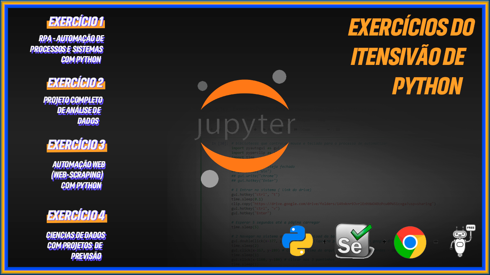

# 👨‍💻️ Intensivão Python organizado pela Hashtag Treinamentos.

 

# Exercício 01 - Automação de Sistemas e Processos com Python
### Desafio:
Todos os dias, o nosso sistema atualiza as vendas do dia anterior. O seu trabalho diário, como analista, é enviar um e-mail para a diretoria, assim que começar a trabalhar, com o faturamento e a quantidade de produtos vendidos no dia anterior

E-mail da diretoria: seugmail+diretoria@gmail.com
Local onde o sistema disponibiliza as vendas do dia anterior: https://drive.google.com/drive/folders/149xknr9JvrlEnhNWO49zPcw0PW5icxga?usp=sharing

Para resolver isso, vamos usar o pyautogui, uma biblioteca de automação de comandos do mouse e do teclado

 

# Exercício 02 - Análise de Dados com Python

### Desafio:

Você trabalha em uma empresa de telecom e tem clientes de vários serviços diferentes, entre os principais: internet e telefone.

O problema é que, analisando o histórico dos clientes dos últimos anos, você percebeu que a empresa está com Churn de mais de 26% dos clientes.

Isso representa uma perda de milhões para a empresa.

O que a empresa precisa fazer para resolver isso?

Base de Dados: https://drive.google.com/drive/folders/1T7D0BlWkNuy_MDpUHuBG44kT80EmRYIs?usp=sharing  
Link Original do Kaggle: https://www.kaggle.com/radmirzosimov/telecom-users-dataset

 

# Exercício 03 - Automação Web e Busca de Informações com Python

#### Desafio: 

Trabalhamos em uma importadora e o preço dos nossos produtos é vinculado a cotação de:
- Dólar
- Euro
- Ouro

Precisamos pegar na internet, de forma automática, a cotação desses 3 itens e saber quanto devemos cobrar pelos nossos produtos, considerando uma margem de contribuição que temos na nossa base de dados.

Base de Dados: https://drive.google.com/drive/folders/1KmAdo593nD8J9QBaZxPOG1yxHZua4Rtv?usp=sharing

Para isso, vamos criar uma automação web:

- Usaremos o selenium
- Importante: baixar o webdriver
 

# Exercício 04 - Projeto Ciência de Dados - Previsão de Vendas

- Nosso desafio é conseguir prever as vendas que vamos ter em determinado período com base nos gastos em anúncios nas 3 grandes redes que a empresa Hashtag investe: TV, Jornal e Rádio

### Passo a Passo de um Projeto de Ciência de Dados

- Passo 1: Entendimento do Desafio
- Passo 2: Entendimento da Área/Empresa
- Passo 3: Extração/Obtenção de Dados
- Passo 4: Ajuste de Dados (Tratamento/Limpeza)
- Passo 5: Análise Exploratória
- Passo 6: Modelagem + Algoritmos (Aqui que entra a Inteligência Artificial, se necessário)
- Passo 7: Interpretação de Resultados

# Projeto Ciência de Dados - Previsão de Vendas

- Nosso desafio é conseguir prever as vendas que vamos ter em determinado período com base nos gastos em anúncios nas 3 grandes redes que a empresa Hashtag investe: TV, Jornal e Rádio
- TV, Jornal e Rádio estão em milhares de reais
- Vendas estão em milhões

